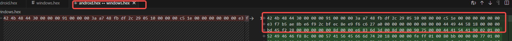
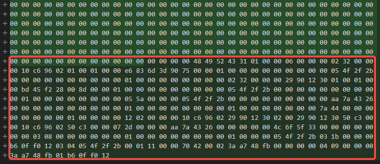
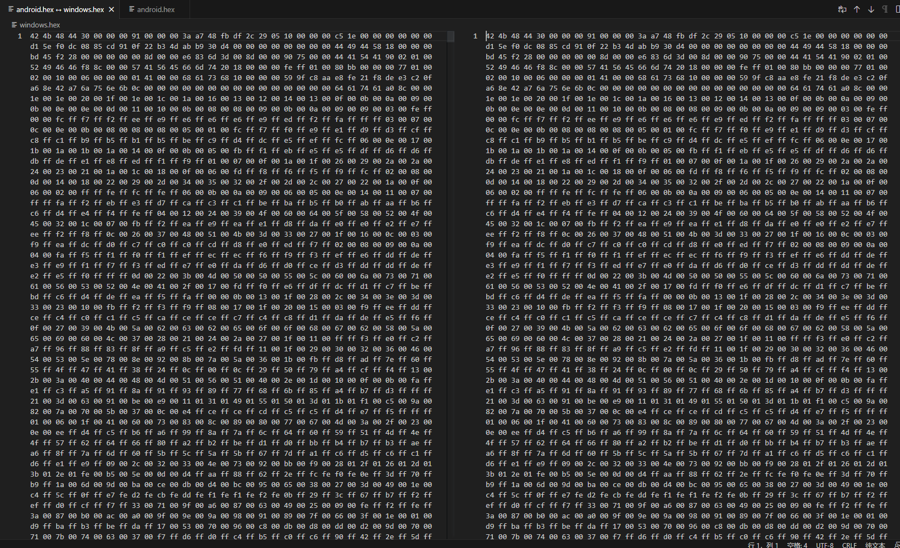

### 背景
### Wwise版本
- 升级前版本：2019.2.14
- 升级后版本：2022.1.3
### 问题描述
#### 过程
Wwise版本升级后，第一次Rebuild Soundbanks 有概率会导致Android平台Bnk出现异常：
- 流媒体:wem文件转码失败
- .bnk(内存加载):Event/Structure/Media信息未能成功构建至Bnk按文件中
#### 原因
- 原因未知，需要查看Wwise源码进行排查，解决成本较大
#### 现象
- 在开发过程中，游戏引擎加载Windows版本的Bnk,声音正常，但游戏打包为真机包体后，加载特定的Bnk资源即会导致游戏崩溃（C++层为：未成功加载bnk数据-->空指针）

### 验证过程
已知现象，以下为验证过程：
#### 随机抽取bnk文件测试
- bnk内容大小：正常
  - md5Bnk内容大小：正常
- Wwise工程内播放正常

#### 资源完整性报告
- 完整性报告无异常

#### 资源上传问题
- 查看历史提交信息，最后一次改动为Wwise升级后，清空本地缓存Rebuild Bnk的上传，与后续操作或后续工具流程的加入无关

#### 其他可能因素
- Wwise工程内Soundbanks无任何内容
- 引用丢失
- 资源未激活
- Bnk中仅包含Event的控制信息

*已验证，以上因素不会对结果产生影响*

### 实际内容差异
将AndroidBnk与WinBnk分别以16进制加载后，保存为.hex文件，然后使用IDE 的Diff功能进行查看：
- Windows与Android文件头信息保持一致（Wwise依赖于头信息，用于识别、解析并加载bnk文件内容）

- 同上，尾信息保持已知（Wwise依赖于该信息以确定音频数据块的区域）

- 测试结果:确认相较于Windows平台的bnk，Android平台的bnk，并未包含音频信息
- 验证
  - 尝试重新生成bnk文件：失败
  - 更改参数后重新生成bnk文件：成功
    - Android平台下，bnk文件大小回复正常
    - 文件16进制验证:无差异
    
- 结论
  Wwise在bnk的rebuild过程中，通过读取头信息，忽略bnk文件的rebuild指令,可以通过批量地属性更改后，使其显式地rebuild

### 解决方法
- [ ] Diff Windows平台&安卓平台地bnk文件
- [ ] 将大小异常（即音频数据未被成功导入地bnk)的bnk筛选出来
- [ ] 创建一个PlaceHolder的空Event，不包含音频内容,避免对最终bnk造成影响
- [ ] 批量插入到错误的Soundbank的Inclusion中(不影响正常使用）
- [ ] 执行GenerateSoundbanks，属性改动可以让bnk显式地rebuild

