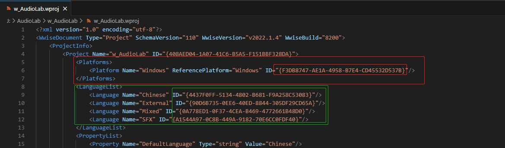

### 介绍
相关介绍见文档：[相关介绍](INSTRUCTION.md)
### 使用方法
本文解决方法如下：
- *Step<1>* 在克隆下来的项目中新建python文件，并引入提供的函数库,后运行即可
```python
from diffBnk import *
DiffBnk.diffErrBnk([这里填languageID],
                   [这里填platformID],
                   这里填空Event的GUID,
                   这里填windowsBnk的地址,
                   这里填androidBnk的地址,
                   这里填bool值（是否保存记录为txt,默认为False）)
```
*注意：languageID&platformID可以通过任意文本编辑器打开工程文件（.wproj)获取*


### 其他功能
#### diffSizeBnk
用于Diff两个地址下所有存在大小差异的bnk并返回txt文档

使用示例：
```python
DiffBnk.diffBnkSize(r"E:\WwiseProject\Project_IMIL\GeneratedSoundBanks\Windows",
                    r"E:\WwiseProject\Project_IMIL\GeneratedSoundBanks\Android")
```
#### diffSizeContent
用于Diff两个bnk文件，并生成两个16进制文件(.hex)，可通过任意IDE对两个文件进行Diff查看

使用示例：
```python
DiffBnk.diffBankContent(r'E:\WwiseProject\Project_IMIL\GeneratedSoundBanks\Android\zh-CN\ST_Vo__Atk04.bnk',
                        r'E:\WwiseProject\Project_IMIL\GeneratedSoundBanks\Windows\zh-CN\ST_Vo__Atk04.bnk')
```

